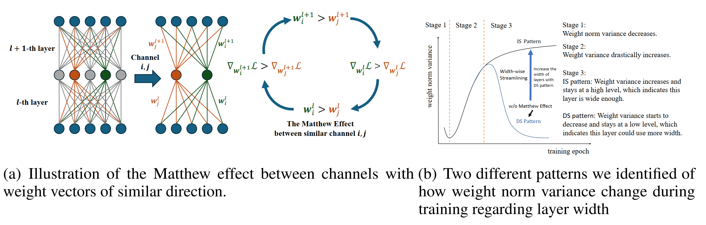

# Unveiling The Matthew Effect Across Channels: Assessing Layer Width Sufficiency via Weight Norm Variance

This is the official repo for the NeurIPS2024 paper **"Unveiling The Matthew Effect Across Channels:
Assessing Layer Width Sufficiency via Weight Norm
Variance"**

## Brief Introduction to The Paper

In this paper, we show that the Matthew effect exist between similar channels where channels with larger weights have larger gradient and could be trained faster.
We further show that wide and narrow layers show two different patterns from the weight variance perspective. For narrow layers, when trained from scratch, the weight norm variance firstly increases and then decreases.
For wide layers, the weight norm variance continuously increases until convergence.

Experiments are conducted over various architectures and datasets to verify our observation. We will provide codes we use to track the weight variance during training.